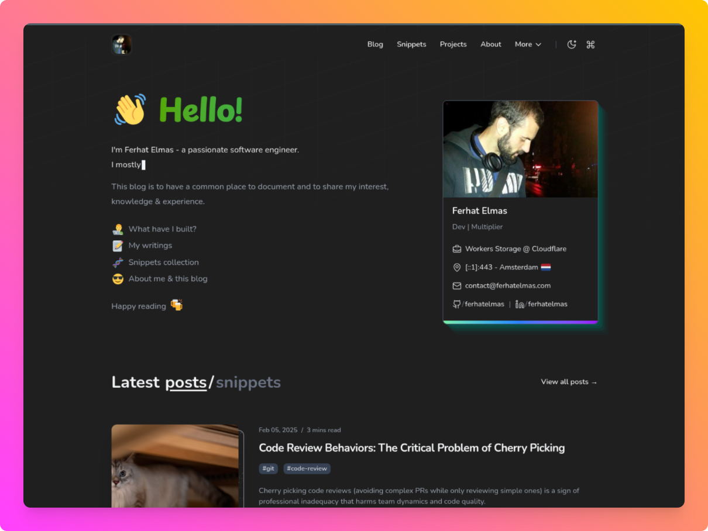

<h1 align="center">ferhatelmas.com 🧑‍💻</h1>

  <i>"My personal website where I document my thoughts, code snippets, programming notes and sharing lessons, insights, and resources I find interesting."</i>

## Motivation

> Sharing is learning!

## Features

- ⚛️ Built with **React 19** and **Next.js 15** (App Router) and **Open Next.js**
- 🎨 Modern, responsive design with [Tailwind CSS](https://tailwindcss.com/)
- 💡 Written in **TypeScript** for better safety
- 📖 MDX for rich content and code snippets
- 🌗 Dark mode using [GitHub dark dimmed](https://github.blog/changelog/2021-04-14-dark-and-dimmed-themes-are-now-generally-available/) colors
- 🧩 Custom components
- 🛠️ Overhauled UI and homepage, easy-to-customize
<!---
TODO: add it later
- 📊 Website analytics with [Analytics Engine](https://developers.cloudflare.com/analytics/analytics-engine/)
-->

## Tech Stack

## Assets & Credits

- Images: [Unsplash](https://unsplash.com/)
- GIFs: [GIPHY](https://giphy.com/)
- Illustrations: [Storyset](https://storyset.com/)

## Fork Status

- This is a fork of [https://www.leohuynh.dev/](https://github.com/hta218/leohuynh.dev) to run on Cloudflare with OpenNext.js and to remove some feature I deem unnecessary. Huge thanks to original authors [Timothy Lin](https://x.com/timlrxx) and [Leo Huynh](https://x.com/hta218_).
